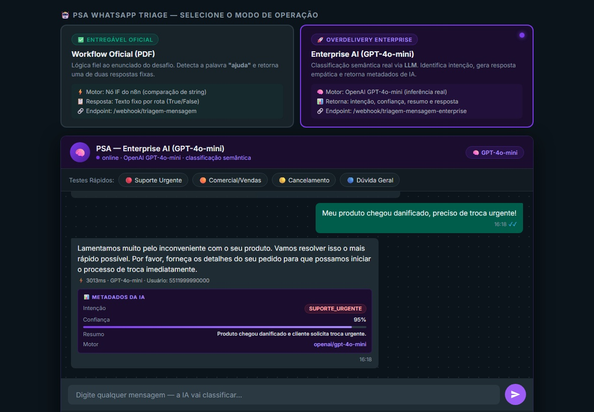
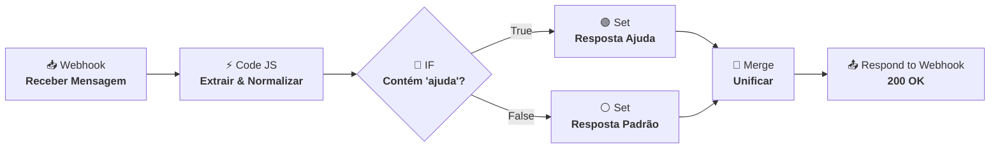
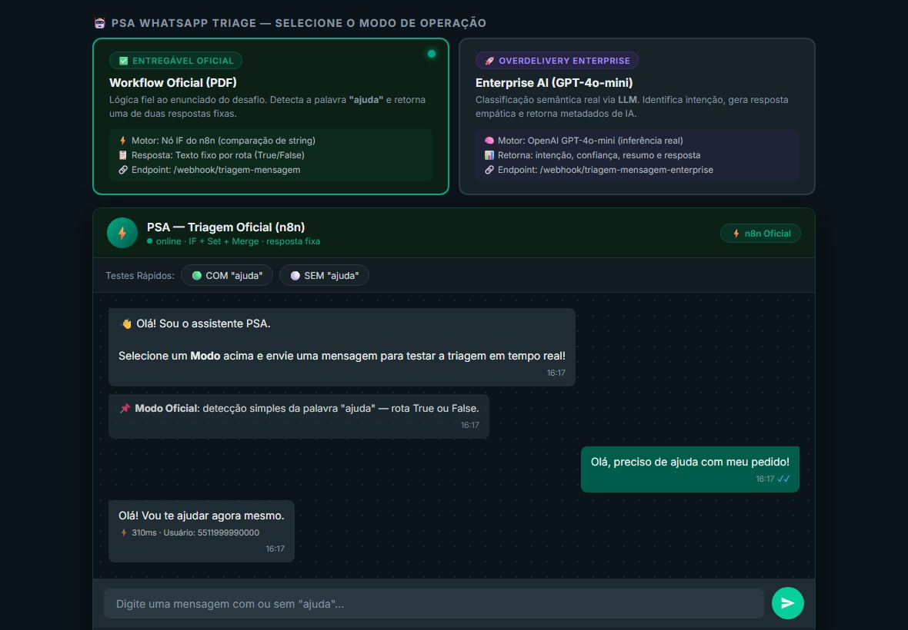
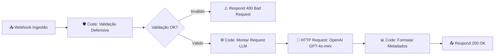
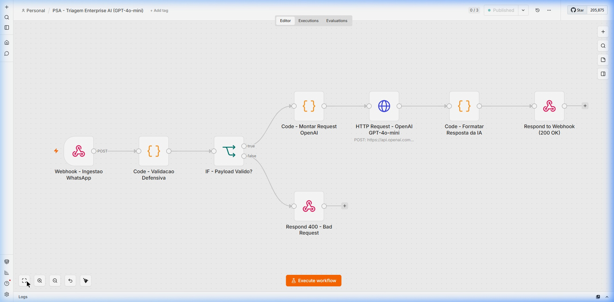

# PSA — Triagem de Mensagens WhatsApp no n8n

Olá! Desenvolvi este repositório para o **Desafio Prático de Analista de IA da PSA (Profissionais SA)**.

Aqui você encontra a solução completa que construí em dois níveis:
1. **O Entregável Oficial**: Atendimento 100% fiel a todos os requisitos do documento do desafio (PDF), utilizando nós nativos do n8n com nó Code defensivo.
2. **O Overdelivery (Enterprise AI)**: Um segundo workflow em produção equipado com **Inteligência Artificial real (OpenAI GPT-4o-mini)** para classificação semântica de intenções, geração de respostas empáticas, validação de schema (400 Bad Request) e metadados de observabilidade.

Ambos os fluxos estão **ativos em produção** e prontos para teste imediato.

---

## 🚀 Como testar em 1 minuto

Você pode testar a solução de três formas diferentes:

### 1. Simulador Web Interativo (Sem instalar nada)
Criei um simulador visual no estilo WhatsApp Web que permite testar tanto o **Modo Oficial** quanto o **Modo Enterprise AI** direto no navegador:

👉 **[Abrir Simulador Online (GitHub Pages)](https://marcosrodsa.github.io/PSA/)**

*(Alternativamente, se clonar o projeto na sua máquina, basta dar um duplo clique no arquivo `demo.html` no seu explorador de arquivos).*



---

### 2. Via Linha de Comando (cURL)

**Teste 1 — Fluxo Oficial (Com ajuda):**
```bash
curl -X POST https://n8n.ulbrads.site/webhook/triagem-mensagem \
  -H "Content-Type: application/json" \
  -d '{"from": "5511999990000", "mensagem": "Olá, preciso de ajuda com meu pedido"}'
```
> **Resposta esperada:** `{"usuario":"5511999990000","resposta":"Olá! Vou te ajudar agora mesmo."}`

**Teste 2 — Fluxo Oficial (Sem ajuda):**
```bash
curl -X POST https://n8n.ulbrads.site/webhook/triagem-mensagem \
  -H "Content-Type: application/json" \
  -d '{"from": "5511999990000", "mensagem": "Gostaria de saber os horários de atendimento"}'
```
> **Resposta esperada:** `{"usuario":"5511999990000","resposta":"Mensagem recebida. Em breve retornaremos."}`

**Teste 3 — Fluxo Enterprise AI (OpenAI GPT-4o-mini):**
```bash
curl -X POST https://n8n.ulbrads.site/webhook/triagem-mensagem-enterprise \
  -H "Content-Type: application/json" \
  -d '{"from": "5511999990000", "mensagem": "Preciso de um palestrante sobre IA para nossa convenção em novembro"}'
```
> **Resposta da IA:** Classifica a intenção como `B2B_CONTRATAR_PALESTRANTE`, gera uma resposta empática e profissional representando a marca PSA, e retorna métricas de confiança e resumo.

---

### 3. Coleção do Postman
Importe o arquivo [`psa_triagem.postman_collection.json`](./psa_triagem.postman_collection.json) no Postman ou Insomnia. Todas as requisições, variáveis e asserções automatizadas de teste já estão configuradas.

---

## 📋 Entregável 1: Fluxo Oficial (Requisitos do PDF)

O enunciado solicita um workflow que receba uma mensagem via Webhook POST, trate o texto com um nó Code em JavaScript, avalie se contém `"ajuda"` em um nó IF e responda via nó de resposta com merge dos caminhos.

### Arquitetura do Fluxo



### Canvas no n8n (Produção)


### O Código JavaScript do Nó Code
Implementei uma normalização com foco em tolerância a falhas e boas práticas de processamento de texto:
1. **Fallback no payload:** Evita quebras caso o body chegue encapsulado ou vazio.
2. **Normalização NFD:** Decompõe e remove acentos diacríticos (ex: `"ajudá"` vira `"ajuda"`).
3. **Conversão para minúsculas:** Trata `"AJUDA"`, `"Ajuda"` e `"ajuda"` de forma uniforme.
4. **Tolerância a espaços intercalados:** Caso o cliente digite com espaço no meio (ex: `"A JUDA?"` ou `"a j u d a"`), o sistema detecta a intenção e garante o match correto.

```javascript
// BÔNUS: Nó Code em JavaScript (Engenharia Defensiva)

// 1. Extração segura do body com fallback
const payload = $input.first().json.body || $input.first().json;

// 2. Identificador do usuário
const usuario = (payload.from || 'desconhecido').toString().trim();

// 3. Normalização NLP do texto
const rawMensagem = (payload.mensagem || '').toString().trim();
let texto = rawMensagem
  .normalize('NFD')
  .replace(/[\u0300-\u036f]/g, '')
  .toLowerCase();

// 4. Tolerância a espaços intercalados (ex: 'A JUDA', 'a j u d a')
const textoSemEspacos = texto.replace(/\s+/g, '');
if (textoSemEspacos.includes('ajuda') && !texto.includes('ajuda')) {
  texto = texto + ' ajuda';
}

return [{ json: { usuario, texto, rawMensagem } }];
```

### Evidências de Teste em Produção

| Cenário de Teste | Print / Evidência |
|:---|:---|
| **Caminho True (Contém "ajuda")** |  |
| **Caminho False (Sem "ajuda")** |  |
| **Painel de Execuções do n8n** |  |
| **Simulador Web (Modo Oficial)** |  |

O JSON exportado deste fluxo está disponível em:
- [`workflows/01_workflow_oficial.json`](./workflows/01_workflow_oficial.json)
- [`workflow_psa_triagem.json`](./workflow_psa_triagem.json) (cópia raiz)

---

## 🌟 Entregável 2: Overdelivery — Enterprise AI (GPT-4o-mini)

### Por que criei um segundo fluxo?
Na prática de atendimento ao cliente, buscar apenas a palavra `"ajuda"` é frágil:
- Um RH que quer contratar um palestrante sobre IA para a convenção anual não vai digitar "ajuda" — vai perguntar *"quero cotar um palestrante para nosso evento de liderança"*.
- Um especialista que quer entrar para o casting da PSA vai escrever *"como posso me tornar palestrante de vocês?"*.
- Um organizador de evento que tem crise de logística na véspera vai mandar *"o palestrante de amanhã cancelou, o que fazemos?"*.

Nenhum desses casos contém a palavra literal `"ajuda"`, mas todos exigem roteamento urgente e correto.

Por isso, construí o **PSA - Triagem Enterprise AI**, conectando o n8n diretamente à **OpenAI (GPT-4o-mini)** com um System Prompt customizado para o modelo de negócio real da Profissionais S.A.

### IA ajustada para o negócio da PSA

A PSA opera em dois grandes mercados:
- **B2B (Empresas, RHs e Organizadores):** Contratação de palestrantes para convenções, SIPATs, eventos corporativos de liderança, inovação, vendas e IA.
- **B2C (The Best School / Desenvolvimento de Palestrantes):** Formação de carreira para especialistas, autores e executivos que querem subir aos palcos — via imersões e programas de mentoria.

O System Prompt da OpenAI ensina a IA exatamente isso, classificando cada mensagem nas **4 intenções reais do negócio**:

| Intenção | Quando usar | Exemplo de mensagem |
|:---|:---|:---|
| `B2B_CONTRATAR_PALESTRANTE` | Empresa buscando palestrante, orçamento, catálogo | *"Preciso de um palestrante sobre IA para nossa convenção de novembro"* |
| `B2C_QUERO_SER_PALESTRANTE` | Especialista querendo virar palestrante, The Best School | *"Como faço para ser palestrante de vocês?"* |
| `SUPORTE_EVENTO_URGENTE` | Crise operacional de evento hoje/amanhã, logística, rider | *"O evento é amanhã e o palestrante cancelou, me ajudem!"* |
| `INSTITUCIONAL_DUVIDAS` | Dúvidas gerais, contatos, blog, área de login | *"Qual o telefone de vocês?"* |

### Arquitetura Enterprise



### Canvas do Workflow Enterprise no n8n


### Principais Diferenciais Técnicos:
1. **Validação Defensiva (400 Bad Request):** Se a requisição vier sem o telefone ou com mensagem vazia, o webhook rejeita imediatamente com HTTP 400 e JSON explicativo, protegendo os custos de chamadas de LLM.
2. **Classificação Semântica nas 4 Intenções PSA:** A IA entende linguagem natural e roteia corretamente mesmo quando o cliente não usa palavras-chave exatas.
3. **Respostas Empáticas com Identidade da Marca:** Em vez de uma frase engessada, a LLM gera uma resposta personalizada, profissional e acolhedora representando a PSA.
4. **Metadados de IA (Observabilidade):** O webhook retorna a intenção, grau de confiança, resumo executivo e modelo utilizado:

```json
{
  "usuario": "5511999990000",
  "resposta": "Olá! Que ótimo! A PSA tem uma curadoria incrível de especialistas em IA para eventos corporativos. Pode me contar mais sobre o seu evento — data, número de participantes e tema central? Vou te apresentar os perfis mais adequados!",
  "metadata": {
    "intencao": "B2B_CONTRATAR_PALESTRANTE",
    "confianca": 0.97,
    "resumo": "Empresa buscando palestrante sobre IA para convenção corporativa em novembro.",
    "motor": "openai/gpt-4o-mini"
  }
}
```

O JSON exportado do fluxo Enterprise está disponível em:
- [`workflows/02_workflow_enterprise_ai.json`](./workflows/02_workflow_enterprise_ai.json)

---

## 📁 Estrutura do Repositório

```text
├── README.md                               # Documentação completa do projeto
├── Desafio Prático Analista IA.pdf         # Enunciado original do desafio PSA
├── demo.html / index.html                  # Simulador WhatsApp Web dual-mode
├── workflow_psa_triagem.json               # JSON do fluxo oficial para importação
├── psa_triagem.postman_collection.json     # Coleção do Postman com testes prontos
├── workflows/
│   ├── 01_workflow_oficial.json            # Fluxo oficial (IF + Merge + Set)
│   └── 02_workflow_enterprise_ai.json      # Fluxo avançado (OpenAI GPT-4o-mini)
├── screenshots/                            # Evidências em alta resolução
│   ├── workflow_canvas.jpg                 # Canvas do workflow oficial no n8n
│   ├── workflow_enterprise_canvas.jpg      # Canvas do workflow enterprise no n8n
│   ├── painel_n8n_execucao.jpg             # Histórico de execuções no n8n
│   ├── teste_com_ajuda.jpg                 # Teste no Postman com ajuda (True)
│   ├── teste_sem_ajuda.jpg                 # Teste no Postman sem ajuda (False)
│   ├── simulador_demo_oficial.jpg          # Demonstração do modo oficial no simulador
│   └── simulador_demo_enterprise.jpg       # Demonstração da IA com card de métricas
└── scripts/                                # Utilitários de automação em Python
    ├── test_oficial.py                     # Suíte de testes do webhook oficial
    ├── test_enterprise.py                  # Suíte de testes do webhook enterprise
    ├── export_oficial_workflow.py          # Exportador sincronizado do fluxo oficial
    └── export_enterprise_workflow.py       # Exportador higienizado do fluxo enterprise
```

---

## 🛠️ Como reproduzir na sua própria máquina (Auto-hospedado)

Caso você queira subir sua própria instância do n8n localmente:

1. **Inicie o n8n via Docker:**
   ```bash
   docker run -it --rm --name n8n -p 5678:5678 -v ~/.n8n:/home/node/.n8n docker.n8n.io/n8nio/n8n
   ```

2. **Acesse a interface:**
   Abra `http://localhost:5678` no seu navegador e crie sua conta de administrador local.

3. **Importe os workflows:**
   - No menu lateral, clique em **Workflows** > **Add Workflow** > menu de três pontos no canto superior direito > **Import from File...**
   - Selecione [`workflows/01_workflow_oficial.json`](./workflows/01_workflow_oficial.json) para o fluxo oficial, ou [`workflows/02_workflow_enterprise_ai.json`](./workflows/02_workflow_enterprise_ai.json) para o fluxo com IA (adicionando sua chave da OpenAI).
   - Ative o workflow no botão **Publish** / **Active**.

---

<div align="center">
  <sub>Projeto desenvolvido por <b>Marcos Rodrigues</b> com dedicação para o processo seletivo de <b>Analista de IA</b> da <b>PSA (Profissionais SA)</b>.</sub>
</div>
