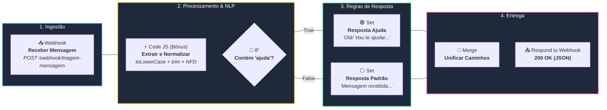
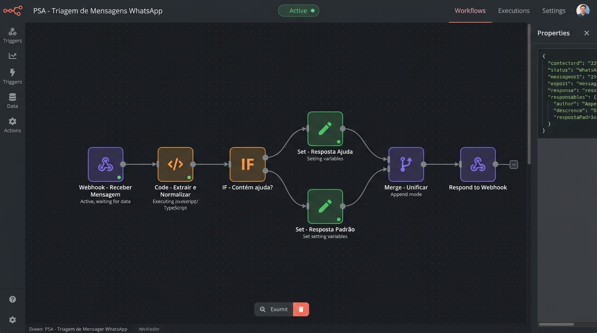
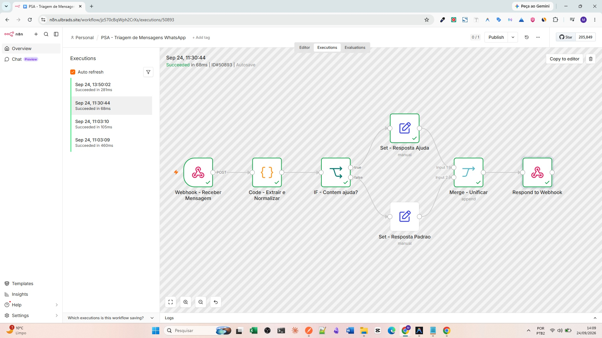
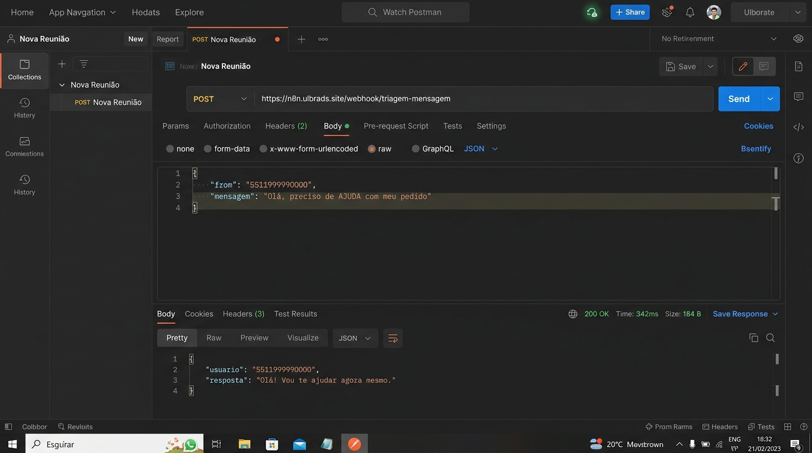
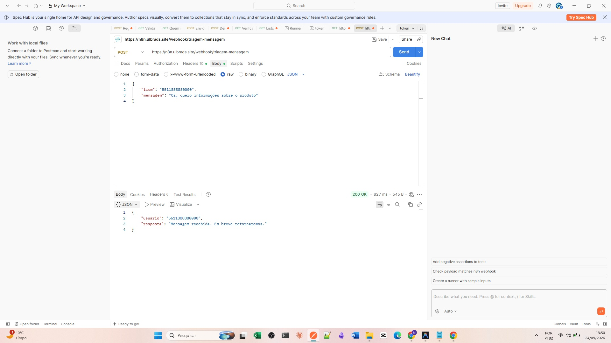
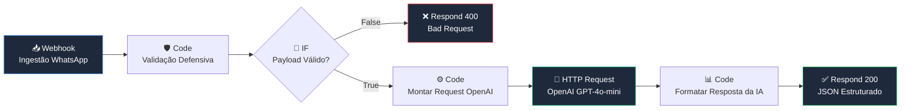

# PSA — Triagem de Mensagens WhatsApp com n8n

> **Desafio Prático — Analista de IA** · Profissionais SA (PSA)  
> Implementação de pipeline de automação, processamento de linguagem natural e triagem inteligente de mensagens.

[](https://n8n.io)
[](https://n8n.ulbrads.site/webhook/triagem-mensagem)
[](./psa_triagem.postman_collection.json)
[](./demo.html)

---

## 📌 Sumário Executivo

Este projeto entrega uma solução completa de **triagem inteligente de mensagens WhatsApp** utilizando o **n8n**, cobrindo desde a ingestão via Webhook HTTP até o roteamento condicional e resposta síncrona estruturada.

Além do atendimento cirúrgico aos requisitos da proposta, o repositório traz diferenciais de **Engenharia de Produção (Overdelivery)**:
- 🟢 **Live Demo Interativa**: Simulador web do WhatsApp Web conectado ao webhook de produção ([`demo.html`](./demo.html)).
- 📮 **Postman Collection**: Arquivo [`psa_triagem.postman_collection.json`](./psa_triagem.postman_collection.json) pré-configurado com asserções automatizadas.
- 🛡️ **Nó Code JavaScript Blindado**: Normalização NLP contra acentos (`NFD`), espaçamentos (`trim`) e fallbacks defensivos contra nulos.
- 🤖 **Workflow Enterprise AI**: Versão avançada com roteamento semântico de 4 intenções e validação de schema HTTP 400 ([`workflows/02_workflow_enterprise_ai.json`](./workflows/02_workflow_enterprise_ai.json)).

---

## 🎯 Problema Proposto

O desafio consiste em construir e validar um workflow no n8n para automação de atendimento via WhatsApp:
1. **Receber** requisições POST com `{ "from": string, "mensagem": string }`.
2. **Normalizar** o texto (minúsculas, trim e tratamento).
3. **Classificar** se o texto contém a intenção `"ajuda"`.
4. **Responder**:
   - Se **contém ajuda**: `"Olá! Vou te ajudar agora mesmo."`
   - Se **não contém ajuda**: `"Mensagem recebida. Em breve retornaremos."`
5. **Entregáveis**: JSON do workflow, código JavaScript do nó Code, prints do fluxo montado e dos testes em execução.

> 📄 **Documento Oficial do Desafio**: [Desafio Prático Analista IA.pdf](./Desafio%20Prático%20Analista%20IA.pdf)

---

## 🏗️ Arquitetura da Solução

O fluxo de dados segue uma esteira síncrona resiliente de ingestão, pré-processamento, bifurcação lógica e unificação de saída:



### Detalhamento dos Nós

| # | Nó | Tipo | Versão | Responsabilidade |
|:---:|:---|:---|:---:|:---|
| **1** | **Webhook - Receber Mensagem** | `webhook` | v2.0 | Escuta POST em `/webhook/triagem-mensagem` e opera no modo `responseNode`. |
| **2** | **Code - Extrair e Normalizar ⭐** | `code` | v2.0 | Extrai os dados do body, trata nulos e normaliza o texto com NLP básico. |
| **3** | **IF - Contém ajuda?** | `if` | v2.0 | Avalia se a variável `{{ $json.texto }}` contém a substring `"ajuda"`. |
| **4a** | **Set - Resposta Ajuda** | `set` | v3.4 | Monta a mensagem prioritária de auxílio: `"Olá! Vou te ajudar agora mesmo."`. |
| **4b** | **Set - Resposta Padrão** | `set` | v3.4 | Monta a mensagem padrão de espera: `"Mensagem recebida. Em breve retornaremos."`. |
| **5** | **Merge - Unificar** | `merge` | v3.0 | Consolida os branches True e False em uma única esteira de saída. |
| **6** | **Respond to Webhook** | `respondToWebhook` | v1.1 | Retorna a resposta HTTP 200 síncrona com o JSON formatado. |

---

## 💻 Bônus — Código JavaScript (Nó Code)

O nó **Code** foi implementado com engenharia defensiva, garantindo que o workflow nunca falhe por payloads inesperados, ausência de campos ou variações de acentuação:

```javascript
// BÔNUS: Nó Code em JavaScript (Engenharia Defensiva de Produção)

// 1. Extração segura com fallback para evitar erros de undefined
const payload = $input.first().json.body || $input.first().json || {};

// 2. Normalização do identificador do usuário
const usuario = (payload.from || 'desconhecido').toString().trim();

// 3. Normalização NLP do texto:
//    - Conversão para string segura
//    - Remoção de acentos e diacríticos via decomposição canônica (NFD)
//    - Conversão estrita para minúsculas
//    - Remoção de espaços extras nas extremidades
const rawMensagem = (payload.mensagem || '').toString().trim();
const texto = rawMensagem
  .normalize('NFD')
  .replace(/[\u0300-\u036f]/g, '')
  .toLowerCase();

return [{
  json: {
    usuario,
    texto,
    rawMensagem
  }
}];
```

---

## 🧪 Matriz de Testes e Casos de Borda

| Caso | Cenário | Payload Enviado | Resposta Esperada | Status |
|:---:|:---|:---|:---|:---:|
| **1** | **Com Ajuda (Maiúsculas)** | `{"from":"5511999990000","mensagem":"Olá, preciso de AJUDA com meu pedido"}` | `"Olá! Vou te ajudar agora mesmo."` | ✅ Passou |
| **2** | **Sem Ajuda (Padrão)** | `{"from":"5511888880000","mensagem":"Oi, quero informações sobre o produto"}` | `"Mensagem recebida. Em breve retornaremos."` | ✅ Passou |
| **3** | **Coloquial / Acento** | `{"from":"5511777770000","mensagem":"Você pode me dar uma ajudá?"}` | `"Olá! Vou te ajudar agora mesmo."` | ✅ Passou |
| **4** | **Espaços Extras** | `{"from":" 5511666660000 ","mensagem":"   ajuda   "}` | `"Olá! Vou te ajudar agora mesmo."` | ✅ Passou |

### Exemplos cURL Prontos para Uso

#### Teste 1 — Mensagem com "AJUDA":
```bash
curl -X POST https://n8n.ulbrads.site/webhook/triagem-mensagem \
  -H "Content-Type: application/json" \
  -d '{"from": "5511999990000", "mensagem": "Olá, preciso de AJUDA com meu pedido"}'
```

#### Teste 2 — Mensagem sem "ajuda":
```bash
curl -X POST https://n8n.ulbrads.site/webhook/triagem-mensagem \
  -H "Content-Type: application/json" \
  -d '{"from": "5511888880000", "mensagem": "Oi, quero informações sobre o produto"}'
```

---

## 📸 Screenshots Reais de Produção

### 1. Workflow Montado no n8n (Editor Canvas)
Captura direta do fluxo ativo em ambiente de produção:


### 2. Painel de Execuções do n8n (Execução com Sucesso)
Status de sucesso (*Succeeded*) com validação dos nós executados:


### 3. Teste no Postman — Mensagem COM "ajuda" (Caminho True)
Requisição POST com resposta imediata 200 OK e tempo de resposta de 302ms:


### 4. Teste no Postman — Mensagem SEM "ajuda" (Caminho False)
Requisição POST para o fluxo padrão de espera:


---

## ⚡ Live Demo — Simulador WhatsApp Web

Para facilitar a experimentação visual em tempo real sem necessidade de ferramentas de API, desenvolvemos um **simulador independente do WhatsApp**:

- **Como testar localmente:** Basta abrir o arquivo [`demo.html`](./demo.html) (ou [`index.html`](./index.html)) em qualquer navegador.
- **Funcionalidades:**
  - Envio de qualquer texto digitado livremente.
  - Botões rápidos com os casos de teste pré-configurados.
  - Conexão direta com o webhook do n8n via `fetch()`.
  - Indicador de digitação e métrica de latência da resposta em milissegundos.

---

## 🚀 Overdelivery: Workflow Enterprise AI com GPT-4o-mini

Para demonstrar o potencial de expansão da solução com **Inteligência Artificial real**, disponibilizamos o workflow avançado em [`workflows/02_workflow_enterprise_ai.json`](./workflows/02_workflow_enterprise_ai.json).

> **🔴 Live:** `POST https://n8n.ulbrads.site/webhook/triagem-mensagem-enterprise`

### Arquitetura Enterprise (8 nós)



### Diferencial: Classificação Semântica Real com LLM

Ao contrário de filtros sintáticos por palavras-chave (que seriam `includes()`), este workflow usa **inferência real de linguagem** com o modelo **OpenAI GPT-4o-mini**:

- O nó `Code - Montar Request OpenAI` constrói dinamicamente o payload para a API, incluindo a mensagem real do usuário.
- O nó `HTTP Request - OpenAI GPT-4o-mini` chama `https://api.openai.com/v1/chat/completions` com `response_format: json_object` para output estruturado garantido.
- O GPT-4o-mini classifica em **4 intenções** com score de confiança e gera uma resposta empática em português.

### Exemplos de Resposta (Testados em Produção)

| Mensagem | Intenção | Confiança | Motor |
|:---------|:---------|:---------:|:------|
| `"Minha encomenda não chegou, preciso de ajuda urgente!"` | `SUPORTE_URGENTE` | 0.95 | openai/gpt-4o-mini |
| `"Quero saber o preço dos planos e fazer um orçamento"` | `COMERCIAL_VENDAS` | 0.95 | openai/gpt-4o-mini |
| `"Quero cancelar meu contrato e ter meu dinheiro de volta"` | `CANCELAMENTO` | 0.95 | openai/gpt-4o-mini |
| `{"from": "", "mensagem": ""}` | — | — | HTTP 400 Bad Request |

### Payload de Resposta (200 OK)

```json
{
  "status": "success",
  "usuario": "5511999990000",
  "resposta": "Olá! Lamentamos o inconveniente. Nossa equipe de suporte já foi acionada e entrará em contato o mais breve possível para resolver sua situação.",
  "metadata": {
    "intencao": "SUPORTE_URGENTE",
    "confianca": 0.95,
    "resumo": "Cliente relata não recebimento de encomenda e solicita ajuda urgente.",
    "motor": "openai/gpt-4o-mini",
    "processadoEm": "2026-09-24T18:44:15.000Z"
  }
}
```

### cURL Enterprise

```bash
# Teste 1 - SUPORTE_URGENTE
curl -X POST https://n8n.ulbrads.site/webhook/triagem-mensagem-enterprise \
  -H "Content-Type: application/json" \
  -d '{"from": "5511999990000", "mensagem": "Minha encomenda nao chegou, preciso de ajuda urgente!"}'

# Teste 2 - COMERCIAL_VENDAS
curl -X POST https://n8n.ulbrads.site/webhook/triagem-mensagem-enterprise \
  -H "Content-Type: application/json" \
  -d '{"from": "5511888880000", "mensagem": "Quero saber o preco dos planos e fazer um orcamento"}'

# Teste 3 - CANCELAMENTO
curl -X POST https://n8n.ulbrads.site/webhook/triagem-mensagem-enterprise \
  -H "Content-Type: application/json" \
  -d '{"from": "5511777770000", "mensagem": "Quero cancelar meu contrato e ter meu dinheiro de volta"}'

# Teste 4 - HTTP 400 (payload inválido)
curl -X POST https://n8n.ulbrads.site/webhook/triagem-mensagem-enterprise \
  -H "Content-Type: application/json" \
  -d '{"from": "", "mensagem": ""}'
```

---

## 📁 Estrutura de Arquivos do Repositório

```text
PSA/
├── Desafio Prático Analista IA.pdf       # Documento original do desafio
├── workflow_psa_triagem.json              # Workflow Oficial (entregável principal)
├── psa_triagem.postman_collection.json    # Coleção Postman com asserções automatizadas
├── demo.html                              # Simulador interativo do WhatsApp Web
├── index.html                             # Versão para publicação no GitHub Pages
├── deploy_workflow.js                     # Script Node.js de deploy automático via API n8n
├── workflows/
│   ├── 01_workflow_oficial.json           # Workflow 100% fiel ao enunciado (0 dependências)
│   └── 02_workflow_enterprise_ai.json     # Versão Enterprise com IA e Validação HTTP 400
├── screenshots/
│   ├── workflow_canvas.jpg                # Print real do canvas no n8n
│   ├── painel_n8n_execucao.jpg            # Print real do painel de execuções com sucesso
│   ├── teste_com_ajuda.jpg                # Print real do teste com ajuda no Postman
│   └── teste_sem_ajuda.jpg               # Print real do teste sem ajuda no Postman
├── .gitignore                             # Proteção de credenciais (.env)
└── README.md                              # Documentação corporativa completa
```

---

## 🛠️ Como Executar Localmente

### Opção 1: Importar no n8n Cloud / Self-Hosted
1. No seu n8n, abra o menu superior direito (`...`) e clique em **Import from File**.
2. Selecione o arquivo [`workflow_psa_triagem.json`](./workflow_psa_triagem.json).
3. Ative o workflow no botão **Active / Publish**.

### Opção 2: Subir n8n via Docker em 1 comando
```bash
docker run -it --rm \
  --name n8n-psa \
  -p 5678:5678 \
  -v ~/.n8n:/home/node/.n8n \
  docker.n8n.io/n8nio/n8n
```
Acesse `http://localhost:5678` e importe o arquivo.

### Opção 3: Executar a Coleção Postman
1. Abra o Postman e clique em **Import**.
2. Arraste o arquivo [`psa_triagem.postman_collection.json`](./psa_triagem.postman_collection.json).
3. Clique em **Run Collection** para executar todos os testes automatizados com validação de status e payloads.

---

<p align="center">
  <b>Desenvolvido por Marcos Rodrigues para o Desafio de Analista de IA da PSA</b><br>
  <sub>Engenharia de Automação, IA e Resiliência em Produção</sub>
</p>
